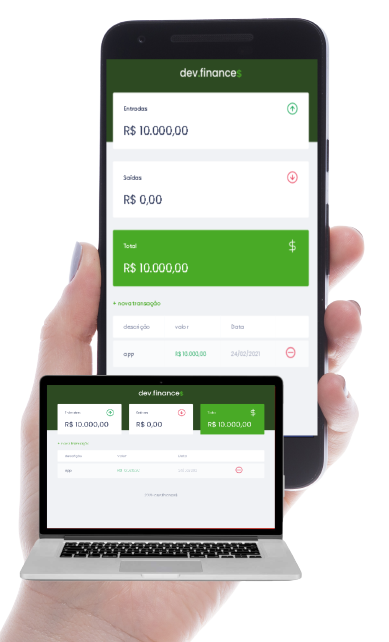

 <h1 align="center">
  
</h1>

  <a href="#-Tecnologies">Tecnologies</a>&nbsp;&nbsp;&nbsp;|&nbsp;&nbsp;&nbsp;
  <a href="#-Project">Project</a>&nbsp;&nbsp;&nbsp;|&nbsp;&nbsp;&nbsp;
  <a href="#-Layout">Layout</a>&nbsp;&nbsp;&nbsp;|&nbsp;&nbsp;&nbsp;

  

 ## 🚀 Tecnologies

This project has been developed with the following technologies:

- HTML
- CSS
- JavaScript

## 💻 Project

The dev.finances is an aplication to control your wallet, where it is possible to register and kill transactions and see the incoming and outgoing balance💰

## 🔖 Layout

check out it in this link [layout](https://www.figma.com/file/7Vu9DzUaCZIV4nibzkjgB4/dev.finance%24-Maratona-Discover). Account is required at [Figma](https://figma.com) to access it.

